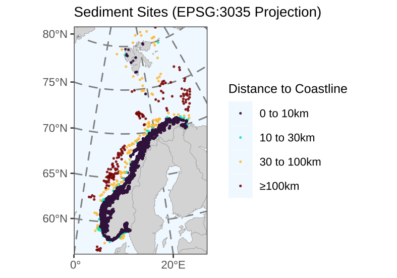

As the initial data analysis will be performed on the Vannmiljø sites located within Norwegian fjords and surrounding areas near the Norwegian coastline, the distances to the nearest coastline were calculated.

The distance data is available in the `dist_to_coast` column of the [Site](db-schema.qmd#site-table) table.

## Sediment Sites

### Distance Calculation
{.zoomable width=80%}

### Count of Four Groups

The table summarises how many observations fall into each of the four groups, broken down by distance categories.

```{r}
library(tibble)

core_dist <- tibble(Distance = c("0 to 10km", "10 to 30km", "30 to 100km", "≥100km"),
       `# Sediment Cores` = c(20710, 40, 130, 143))
core_dist
```

## Methods

Coastline data were derived from the **Global Self-consistent, Hierarchical, High-resolution Geography** ([GSHHG](https://www.soest.hawaii.edu/pwessel/gshhg/)) database. High-resolution shoreline polygons were extracted for the region covering the Norwegian mainland and the Svalbard archipelago. The coastline geometry was cleaned and filtered to ensure topological validity before calculation.

To ensure accurate measurements at high latitudes, where standard global projections (like Mercator) distort distances, all spatial data were projected to the **ETRS89-extended Lambert Azimuthal Equal Area projection (EPSG:3035)**. This Coordinate Reference System is the standard for pan-European statistical mapping and minimizes distortion across the region. The shortest Euclidean distance from each sampling site to the nearest Norwegian coastline geometry was then calculated in meters.

The calculation was performed using the [sf](https://cran.r-project.org/web/packages/sf/index.html) library in R.
